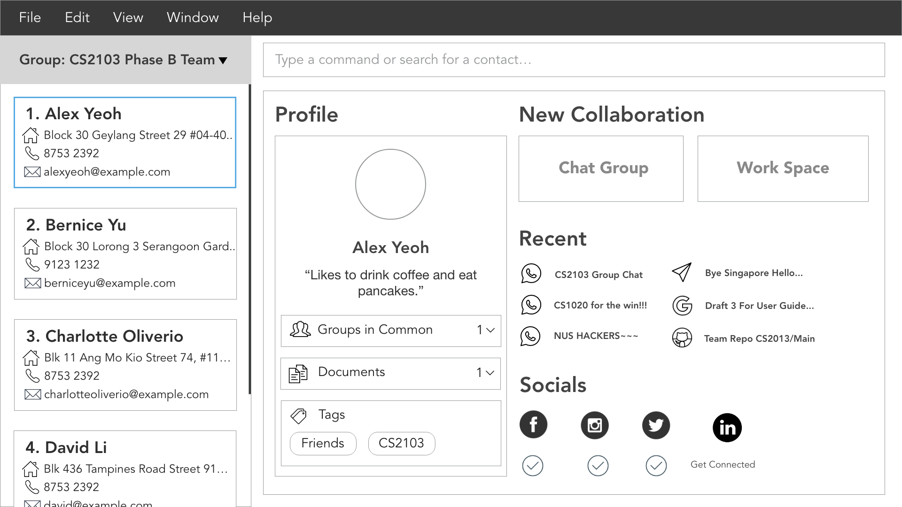

= Address Book (Level 4)
ifdef::env-github,env-browser[:relfileprefix: docs/]
ifdef::env-github,env-browser[:outfilesuffix: .adoc]

image:https://travis-ci.org/CS2103AUG2017-F11-B4/main.svg?branch=master["Build Status", link="https://travis-ci.org/CS2103AUG2017-F11-B4/main"]
https://ci.appveyor.com/project/HanYaodong/addressbook-level4[image:https://ci.appveyor.com/api/projects/status/ty4qo9iad6m892np?svg=true[Build status]]
https://coveralls.io/github/CS2103AUG2017-F11-B4/main?branch=master[image:https://coveralls.io/repos/github/CS2103AUG2017-F11-B4/main/badge.svg?branch=master[Coverage Status]]

ifdef::env-github[]

endif::[]

ifndef::env-github[]
image::images/Ui.png[width="600"]
endif::[]

== Target Audience

* This Address Book application is primarily designed with University students in mind.
* Problems:
** In a Univesity setting, there are many opportunities for collaboration. However, with the multitude of collaboration platforms available (e.g. Slack, Telegram, Github etc.), collecting user information for individual platforms quickly becomes tedious.
** Beyond work-related collaborations, University is also a place for expanding one's social network. However, the context does not often provide an opportunity for group mates to request for each other's social profiles (e.g. LinkedIn, Facebook etc.)
* Solution:
** Address Book Pro aims to be a unified platform where users can collect all important information of their group mates, all in one go.
** Address Book Pro also provides an easy-access to group mates' social media profiles, which serves to faciliate networking.

* This is a desktop Address Book application. It has a GUI but most of the user interactions happen using a CLI (Command Line Interface).
* It is a Java sample application intended for students learning Software Engineering while using Java as the main programming language.
* It is *written in OOP fashion*. It provides a *reasonably well-written* code example that is *significantly bigger* (around 6 KLoC)than what students usually write in beginner-level SE modules.
* What's different from https://github.com/se-edu/addressbook-level3[level 3]:
** A more sophisticated GUI that includes a list  panel and an in-built Browser.
** More test cases, including automated GUI testing.
** Support for _Build Automation_ using Gradle and for _Continuous Integration_ using Travis CI.

== Site Map

* <<UserGuide#, User Guide>>
* <<DeveloperGuide#, Developer Guide>>
* <<AboutUs#, About Us>>
* <<ContactUs#, Contact Us>>

== Acknowledgements

* Some parts of this sample application were inspired by the excellent http://code.makery.ch/library/javafx-8-tutorial/[Java FX tutorial] by
_Marco Jakob_.
* Original Source code created by SE-EDU initiative https://github.com/se-edu/

== Licence : link:LICENSE[MIT]
